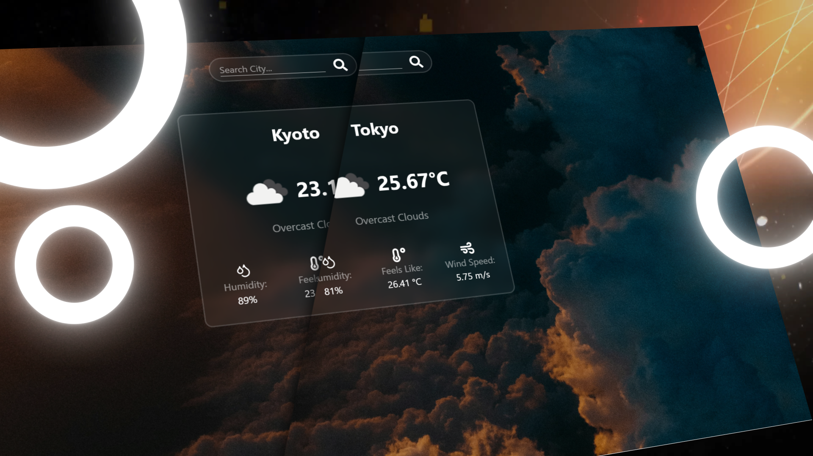
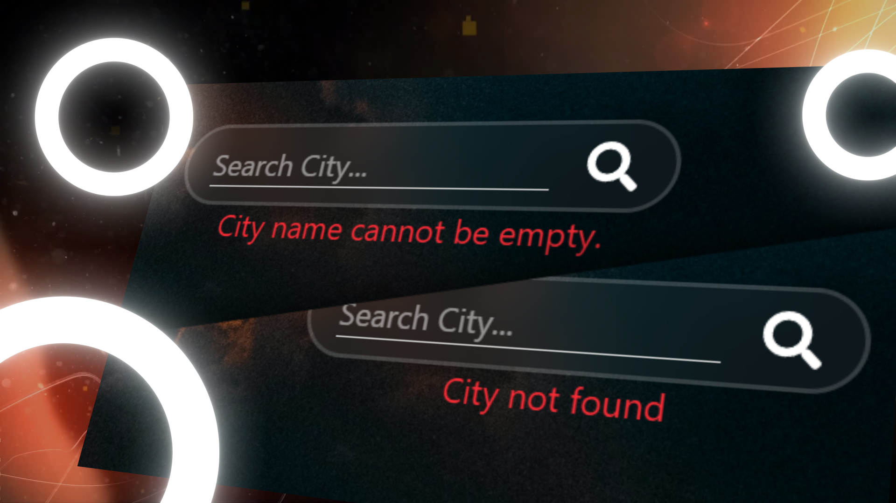

# Weather App

A modern weather application built with Next.js that showcases API integration skills and provides real-time weather information with a beautiful, responsive interface.

🔗**Live Site**: ["link"](Not Available)

## Screenshots

<details>
<summary>Click to view screenshots</summary>




</details>

## Overview

This project demonstrates proficiency in API integration and modern web development by creating a feature-rich weather application. The focus was on building a reliable, user-friendly interface that fetches and displays real-time weather data while maintaining excellent performance and user experience.

## Key Features

### API Integration
- Seamless integration with weather APIs to fetch real-time weather data
- Efficient data handling and error management for robust API calls
- Location-based weather detection with geolocation services

### Component Library
- Developed with modular and reusable components to promote scalability and maintainability
- Weather data visualization components for temperature, humidity, wind speed

### Accessibility & Responsiveness
- Designed with accessibility in mind and fully responsive across all screen sizes and devices
- Optimized for mobile-first weather checking experience

### Advanced Weather Features
- Current weather conditions with detailed metrics
- Location search functionality

## Tech Stack

- Next.js
- React
- Tailwind CSS
- OpenWeatherMap API / WeatherAPI
- React Hooks / Context API

## Result

The result is a fast, reliable, and visually appealing weather application that demonstrates strong API integration skills, modern React development practices, and attention to user experience design.

## Getting Started

```bash
# Clone the repository
git clone https://github.com/urUsername/Weather-App.git
cd weather-app
```

```bash
# Install dependencies
npm install
```

```bash
# Set up environment variables
cp .env.example .env.local
# Add your weather API key to .env.local
NEXT_PUBLIC_WEATHER_API_KEY=your_api_key_here
```

```bash
# Start the development server
npm run dev
```

Then open `http://localhost:3000` in your browser.

## Environment Setup

To run this project, you'll need to obtain an API key from a weather service provider:

1. Sign up at [OpenWeatherMap](https://openweathermap.org/api) or your preferred weather API provider
2. Get your free API key
3. Add it to your `.env.local` file as shown above

